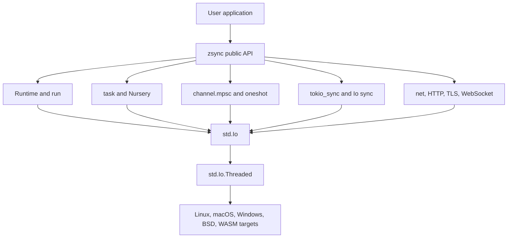

# zsync Documentation

Tokio-style async runtime helpers for Zig, built on `std.Io`.

## Getting Started

- [Quickstart](getting-started/quickstart.md) - Install zsync and run the smallest async task

## Guides

- [Examples](guides/examples.md) - Supported usage patterns
- [Integration](guides/integration.md) - Runtime ownership patterns for downstream projects
- [Performance](guides/performance.md) - Practical runtime and task guidance
- [Migration](guides/migration.md) - Zig `std.Io` migration notes
- [TLS Backend](guides/tls-backend.md) - Native TLS and WASM TLS policy

## Reference

- [API Reference](reference/api.md) - Supported public API surface
- [Tokio Primitives](reference/tokio-primitives.md) - Primitive parity and status

## Internals

- [Architecture](internals/architecture.md) - Runtime structure and module layout
- [std.Io Gap](internals/std-io-gap.md) - How zsync relates to Zig `std.Io`
- [Architecture Diagrams](internals/diagrams.md) - Mermaid diagrams for runtime, HTTP/TLS, and WASM flow

## Platforms

- [WASM](platforms/wasm.md) - WASM runtime model and constraints
- [WASM Host ABI](platforms/wasm-host-abi.md) - Required host imports and ownership rules

## Security

- [Security Policy](security/policy.md) - Runtime security posture and production checklist

## Roadmap

- [Experimental Features](roadmap/experimental-features.md) - Present but not stable APIs
- [Future Roadmap](roadmap/future-roadmap.md) - Planned async runtime work

## Supported Surface

The v0.8.4 supported public surface is:

- `run` / `getGlobalIo`
- `Runtime`
- `Io` (re-exported `std.Io`)
- `Nursery`
- `spawn` / `spawnOn`
- `task`, `time`, `net`, `channel.mpsc`, `tokio_sync`
- root compatibility aliases for existing consumers

Experimental modules and helpers remain in the repository, but they are outside
the stability guarantees for this release unless listed above.

## Runtime Map

## Quick Links

| Area | Canonical Doc |
|---|---|
| Install and first task | [getting-started/quickstart.md](getting-started/quickstart.md) |
| Public API | [reference/api.md](reference/api.md) |
| Tokio-style primitive status | [reference/tokio-primitives.md](reference/tokio-primitives.md) |
| Native TLS and HTTPS | [guides/tls-backend.md](guides/tls-backend.md) |
| WASM host integration | [platforms/wasm-host-abi.md](platforms/wasm-host-abi.md) |
| Security posture | [security/policy.md](security/policy.md) |
| Architecture diagrams | [internals/diagrams.md](internals/diagrams.md) |

The root [README](../README.md) is the project landing page. This directory is
for focused technical documentation.
