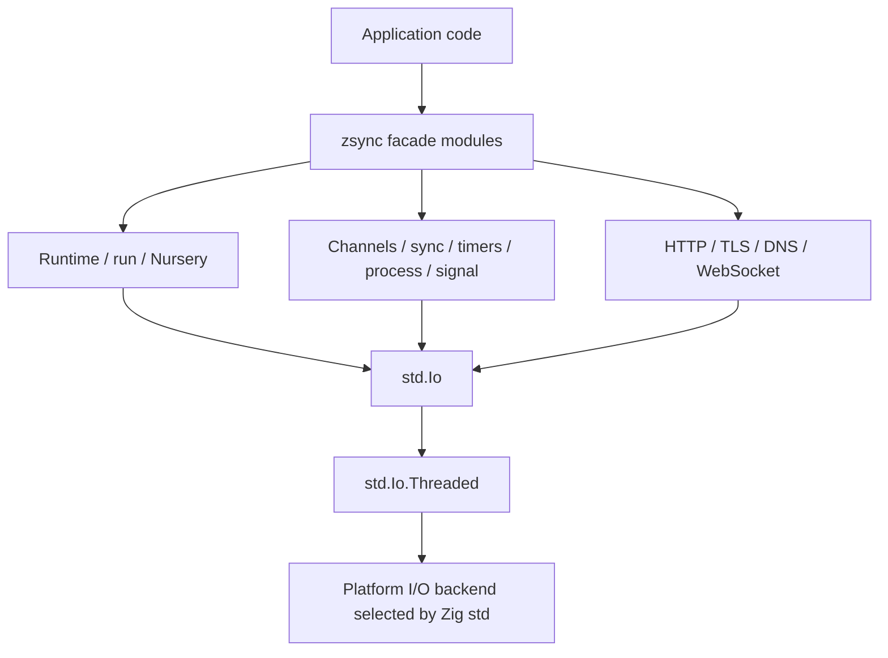
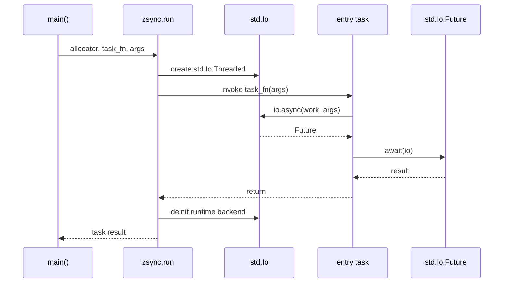
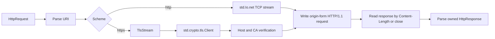
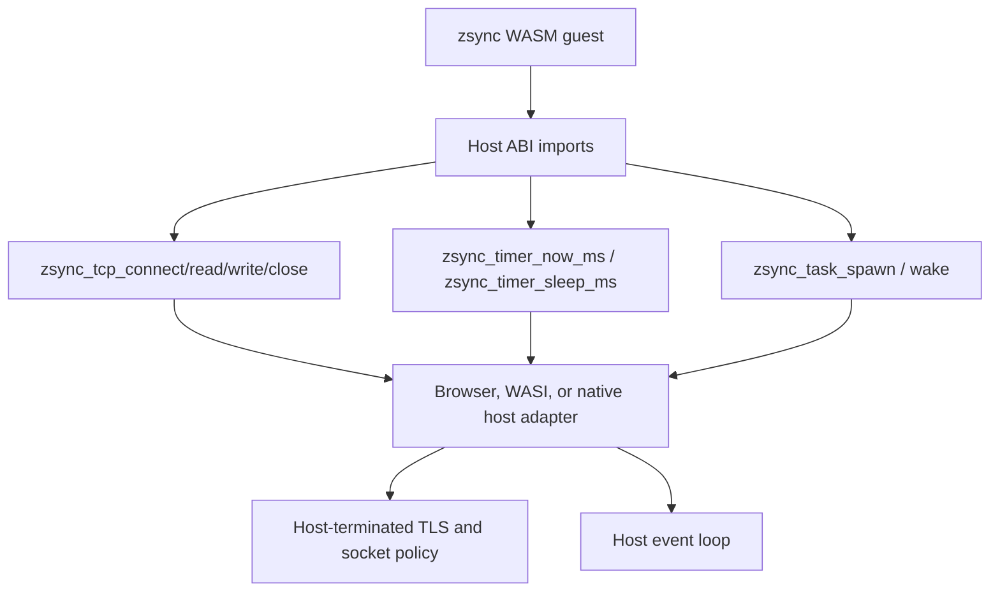
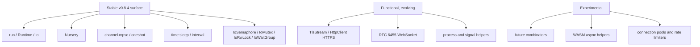

# Architecture Diagrams

Mermaid diagrams for the current zsync runtime shape.

## Runtime Layers

```mermaid
flowchart TB
    app[Application code]
    zsync[zsync facade modules]
    runtime[Runtime / run / Nursery]
    primitives[Channels / sync / timers / process / signal]
    networking[HTTP / TLS / DNS / WebSocket]
    stdio[std.Io]
    threaded[std.Io.Threaded]
    os[Platform I/O backend selected by Zig std]

    app --> zsync
    zsync --> runtime
    zsync --> primitives
    zsync --> networking
    runtime --> stdio
    primitives --> stdio
    networking --> stdio
    stdio --> threaded
    threaded --> os
```

## Task Lifecycle

```mermaid
sequenceDiagram
    participant Main as main()
    participant Run as zsync.run
    participant Io as std.Io
    participant Task as entry task
    participant Future as std.Io.Future

    Main->>Run: allocator, task_fn, args
    Run->>Io: create std.Io.Threaded
    Run->>Task: invoke task_fn(args)
    Task->>Io: io.async(work, args)
    Io-->>Task: Future
    Task->>Future: await(io)
    Future-->>Task: result
    Task-->>Run: return
    Run->>Io: deinit runtime backend
    Run-->>Main: task result
```

## HTTPS Request Flow

```mermaid
flowchart LR
    req[HttpRequest] --> parse[Parse URI]
    parse --> scheme{Scheme}
    scheme -->|http| tcp[std.Io.net TCP stream]
    scheme -->|https| tls[TlsStream]
    tls --> stdtls[std.crypto.tls.Client]
    stdtls --> verified[Host and CA verification]
    tcp --> write[Write origin-form HTTP/1.1 request]
    verified --> write
    write --> read[Read response by Content-Length or close]
    read --> parse_response[Parse owned HttpResponse]
```

## WASM Host Boundary

```mermaid
flowchart TD
    guest[zsync WASM guest] --> abi[Host ABI imports]
    abi --> tcp[zsync_tcp_connect/read/write/close]
    abi --> timer[zsync_timer_now_ms / zsync_timer_sleep_ms]
    abi --> task[zsync_task_spawn / wake]
    tcp --> host[Browser, WASI, or native host adapter]
    timer --> host
    task --> host
    host --> tls_policy[Host-terminated TLS and socket policy]
    host --> event_loop[Host event loop]
```

## Primitive Stability

```mermaid
flowchart TD
    stable[Stable v0.8.4 surface]
    functional[Functional, evolving]
    experimental[Experimental]

    stable --> run[run / Runtime / Io]
    stable --> nursery[Nursery]
    stable --> mpsc[channel.mpsc / oneshot]
    stable --> time[time sleep / interval]
    stable --> iosync[IoSemaphore / IoMutex / IoRwLock / IoWaitGroup]

    functional --> tls[TlsStream / HttpClient HTTPS]
    functional --> websocket[RFC 6455 WebSocket]
    functional --> process[process and signal helpers]

    experimental --> select[future combinators]
    experimental --> wasm[WASM async helpers]
    experimental --> pools[connection pools and rate limiters]
```
